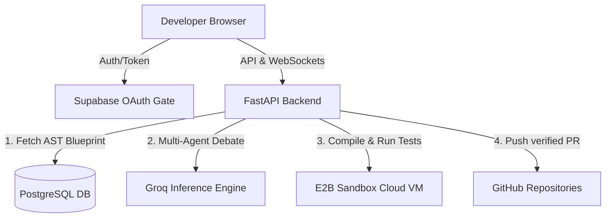

# GitGenesis 🌌

> **Next-Gen Autonomous Agentic Codebase Architect & Refactoring Engine**

🔗 **Live Demo**: [git-genesis.vercel.app](https://git-genesis.vercel.app/)  
🔗 **Backend API Space**: [GitGenesis-Backend on Hugging Face](https://huggingface.co/spaces/nevansonic/GitGenesis-Backend)

GitGenesis is a collaborative multi-agent AI platform that reverse-engineers codebases into interactive visual architecture blueprints. Developers can restructure architecture strategies, debate code edits through AI specialists, run isolated syntax and test suite validation inside secure **E2B Cloud Sandbox VMs**, and sync changes directly to GitHub via secure multi-tenant **GitHub OAuth Pull Requests**.

---

## ✨ Features

- 🧠 **Collaborative Multi-Agent Debate**: Leverages dedicated LLM agents (Planner, Architect, Complexity Analyst, Critic, Code Modifier) that coordinate and debate refactoring strategies before applying code changes.
- 🌐 **Interactive Blueprint Workspace**: View codebases as visual dependency graphs. Create architectural task nodes, modify file connections, and trace ancestor/descendant relationships.
- 🌳 **Multi-Branch Blueprints**: Branch blueprints similar to Git to test divergent design architectures (e.g., comparing a SQL-based variant against a NoSQL-based variant side-by-side).
- 🧪 **E2B Cloud Sandbox Isolation**: Compiles code edits, installs missing dependencies, and runs testing frameworks (`pytest`, `npm test`) inside remote sandbox VMs, removing host system security vulnerabilities and WSL dependencies.
- 🔒 **Secure Multi-Tenancy**: Built on top of **Supabase Auth** & **GitHub OAuth**. Database records are tightly scoped to the logged-in user, and write actions to GitHub are authenticated on behalf of the user's specific OAuth token.
- ⚡ **Ultra-Fast LLM Inference**: Powered by **Groq** for high-throughput, low-latency agent reasoning.

---

## 🛠️ Technology Stack

### Frontend
- **Framework**: Next.js (App Router, TypeScript)
- **Styling**: Vanilla CSS (Neo-brutalist theme) & Tailwind CSS
- **State & Routing**: React Hooks & Next.js Router
- **Client Auth**: `@supabase/supabase-js`

### Backend
- **Core API**: FastAPI (Python)
- **Agent Orchestration**: Custom LangGraph-inspired agent state loops
- **Real-time Streaming**: WebSockets (for live agent logic logs and sandbox progress)
- **Static Analysis**: Abstract Syntax Tree (AST) parsing for Python & Javascript imports

### Infrastructure & Cloud
- **Database & Auth**: Supabase PostgreSQL + Supabase GoTrue Auth (GitHub OAuth)
- **Verification Engine**: E2B Sandbox SDK (Secure Cloud VM containers)
- **LLM Provider**: Groq API (Llama 3/70B model families)

---

## ⚙️ Environment Configuration

To run GitGenesis, create configuration files in both `backend` and `frontend`.

### Backend (`backend/.env`)
```ini
# Database & Authentication
SUPABASE_URL=your_supabase_project_url
SUPABASE_SERVICE_KEY=your_supabase_service_role_key
SUPABASE_DB_CONN=your_postgresql_connection_string

# LLM & Sandboxing APIs
GROQ_API_KEY=your_groq_api_key
E2B_API_KEY=your_e2b_api_key
```

### Frontend (`frontend/.env.local`)
```ini
NEXT_PUBLIC_SUPABASE_URL=your_supabase_project_url
NEXT_PUBLIC_SUPABASE_ANON_KEY=your_supabase_anon_key
```

---

## 🚀 Getting Started

### 1. Set Up the Backend
Ensure you have Python 3.10+ installed:

```bash
cd backend
python -m venv venv
source venv/Scripts/activate # On Windows: venv\Scripts\activate
pip install -r requirements.txt
uvicorn app.main:app --reload --port 8000
```
The API documentation will be available at `http://localhost:8000/docs`.

### 2. Set Up the Frontend
Ensure you have Node.js 18+ installed:

```bash
cd frontend
npm install
npm run dev
```
Open `http://localhost:3000` to start designing your blueprints!

---

## 📐 Architecture Diagram


